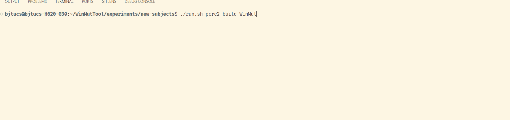
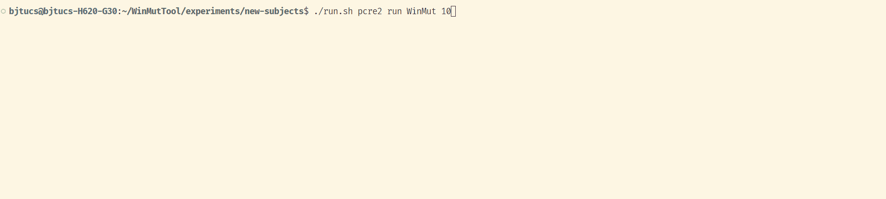
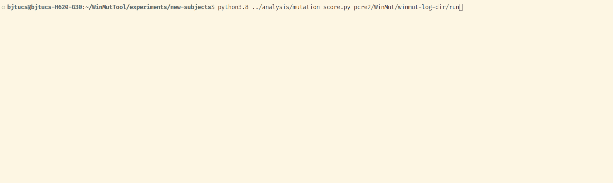

# WinMut++

xxxxxxxxxxx # title of article

## 🚀 Optimization techniques

- **Fewer Processes**: Merge more mutants into one process
- **Smaller Overheads**: Remove redundant interpreter calls

## 🖥️ Online demo

You can try the WinMut++ tool online on the [website](). We provide several small demo files.


## 📚 Usage

### 1. Install

You can build WinMut++ from source.
For specific build method and detailed information, please refer to [WinMut-README](WinMut-README.md).

### 2. Build & Execute

There is a script called `run.sh` to build and execute the subjects.

The usage is
```text
./run.sh subject-name <build/run> <WinMut/WinMutNo/AccMut/AccMutNo/timing/validate> [time-limit/process-limit]
```
Examples:

If you want to run pcre2 with WinMut and restrict the max cases to 10, you should run
```shell
./run.sh pcre2 build WinMut
```



```shell
./run.sh pcre2 run WinMut 10
```


More usage can be found in [here](WinMut-README.md#running-the-experiments-from-the-paper).

### 3. Mutation Score

In order to analyze the running process and calculate the mutation score, WinMut++ outputs some log files to the directory `winmut-log-dir/run` when running.

We provided a python script to analyze the results:

`experiments/analysis/mutation_score.py` reads the ``winmut-log-dir/run` directory to analyze mutation execution results and calculate mutation score.

Examples:
```shell
python3.8 ../analysis/mutation_score.py pcre2/WinMut/winmut-log-dir/run
```



